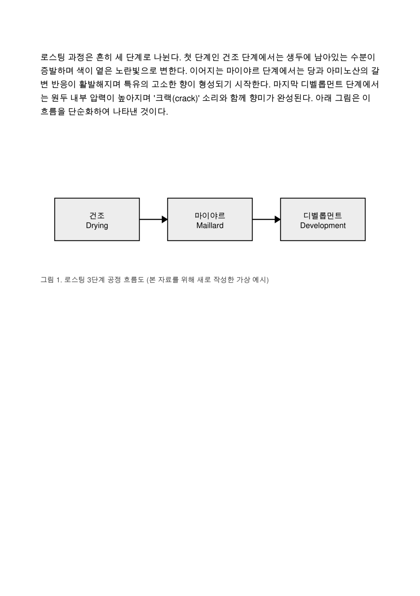
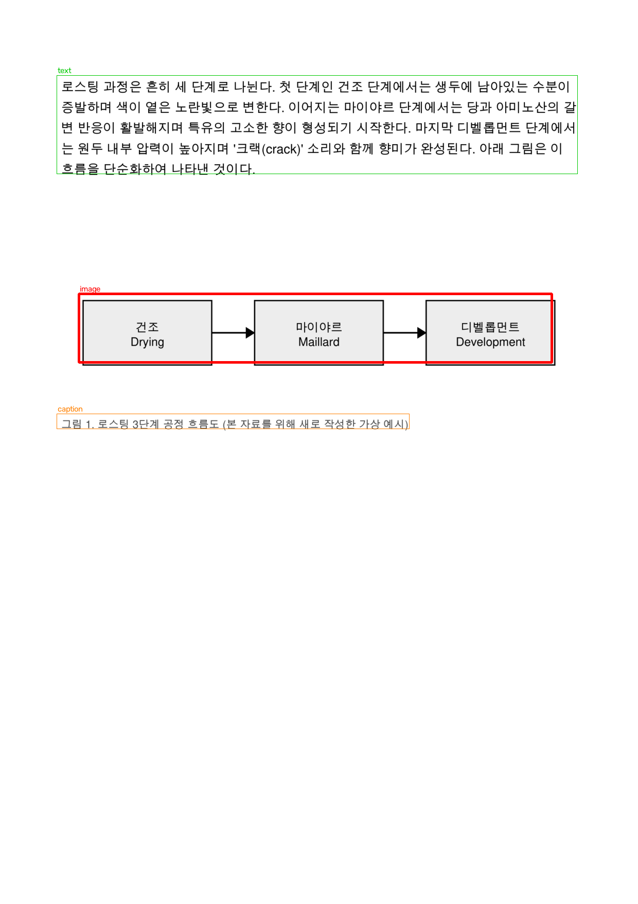

# pdf2epub-v2

[한국어 문서 →](README.ko.md)

[](https://github.com/asdqweasdzxcasd/pdf2epub-v2/actions/workflows/ci.yml)
[](LICENSE)

Turn scanned or image-only PDFs into a clean, reflowable EPUB3 — with diagrams
cropped back into place and tables rendered as real HTML tables, not a wall of
OCR text. Text PDFs convert for free, with no API calls at all. Korean-optimized:
layout and OCR have been validated against real Korean books.

## What it does

Given a page like this:

<p align="center">
  
  
</p>

pdf2epub-v2 detects text blocks, diagrams, and tables on each page, then
rebuilds the page as reflowable EPUB content: body text becomes real
paragraphs, diagrams are cropped out of the rendered page image and
re-embedded as figures, and tables become actual `<table>` markup instead of
OCR'd text soup.

## Why this exists

Tools like [marker](https://github.com/VikParuchuri/marker) and
[MinerU](https://github.com/opendatalab/MinerU) are excellent at turning PDFs
into Markdown — great for feeding documents into an LLM pipeline. pdf2epub-v2
has a different target: a **reader-ready EPUB3 file** you'd actually want to
open in an e-reader. That means diagrams have to stay diagrams (not
alt-text), tables have to stay tables (not flattened rows of text), and
chapter structure has to survive the trip. It's also tuned and validated on
Korean-language books, where layout and OCR quality is often an afterthought
in tools built primarily for English/Latin scripts.

## Quickstart

No PyPI package yet — run from source:

```bash
git clone https://github.com/asdqweasdzxcasd/pdf2epub-v2.git
cd pdf2epub-v2
pip install -r requirements-cli.txt

# Only needed for scanned/image PDFs (see Cost below).
# Get a free key at https://console.mistral.ai/ — no credit card required.
export MISTRAL_API_KEY=your-key-here

python -m scripts.convert your-book.pdf -o your-book.epub
```

Try it instantly with the bundled sample (a copyright-free, self-authored
demo PDF):

```bash
python -m scripts.convert samples/sample.pdf -o sample.epub --ocr api
```

If your PDF already has a text layer (not scanned), no API key is needed —
just drop `--ocr api` and it converts entirely locally and for free.

## How it works

```
PDF → render pages → Mistral OCR (block detection) → crop diagrams +
      build HTML tables → assemble EPUB3
```

1. Each page is rendered to an image and, if present, its embedded text
   layer is read directly (no API call, no cost).
2. For image/scanned pages, the rendered image is sent to Mistral OCR, which
   returns text plus block-level layout (paragraphs, headings, figures,
   tables).
3. Diagram blocks are cropped out of the original page render and embedded
   as images; table blocks are rebuilt as real HTML `<table>` markup instead
   of being left as OCR'd running text.
4. Headings are used to build a heuristic table of contents.
5. Everything is assembled into a standard, reflowable EPUB3 file.

## Data flow & privacy

- Text PDFs never leave your machine — the free path does no network calls.
- For image/scanned PDFs, only the rendered page images are sent to
  Mistral's OCR API (BYOK — you supply your own `MISTRAL_API_KEY`). No other
  service sees your document.
- **Free tier warning**: Mistral's free "Experiment" tier (no credit card
  required) may use submitted inputs for model training. If you're
  converting sensitive or confidential documents, use a paid Mistral tier or
  the `--ocr off` mode (page images embedded, no OCR, no upload).

## Cost

- Text PDFs: free, no API calls.
- Image/scanned PDFs via Mistral OCR: about **$0.004/page** (~$2-4 per 1000
  pages). A 300-page scanned book costs roughly **$1.20**.
- No credit card required to start — Mistral's free tier works out of the
  box, just rate-limited (see Limitations).

## Limitations

- Mistral's free tier is rate-limited to roughly 2 requests/minute; large
  books upload in 40-page chunks with automatic backoff retry on 429s, so
  big scanned books just take longer on the free tier.
- Table of contents is built with heading-level heuristics, not a true
  semantic outline — occasionally over- or under-splits chapters.
- Equations are rendered as images, not as text/MathML.
- If a page's OCR result comes back empty or the API call fails after
  retries, that page falls back to an embedded page image rather than being
  silently dropped — you'll never lose content, but you may get an
  unsearchable page here and there.

## Roadmap

- Publish as a proper PyPI package (`pip install pdf2epub`)
- Local web UI for drag-and-drop conversion
- Support for additional OCR providers beyond Mistral

## License

MIT — see [LICENSE](LICENSE).
